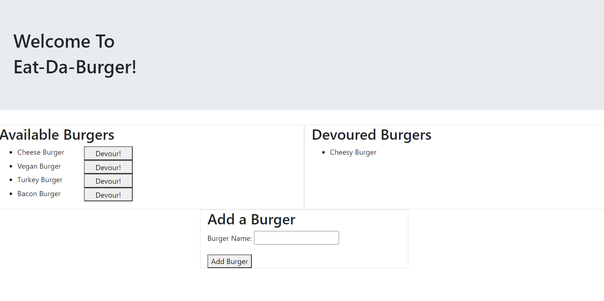

# Eat-Da-Burger
# Description
Eat-Da-Burger! is a restaurant app that lets users input the names of burgers they'd like to eat. Whenever a user submits a burger's name, your app will display the burger on the left side of the page -- waiting to be devoured. Each burger in the waiting area also has a Devour it! button. When the user clicks it, the burger will move to the right side of the page.
# Deployed site:
 [Click Here](https://gentle-brook-36003.herokuapp.com/)
# Table of Contents
* [Installation](#installation)
* [Usage](#usage)
* [License](#license)
* [Contributing](#contributing)
* [Tests](#tests)
* [Questions](#questions)
# Installation
Run npm i for all dependencies and add a .env with your local password
# Usage
Free use.
# License
This work is covered under the CC0 1.0 Universal license.
Full license information can be found here: [License: CC0-1.0](http://creativecommons.org/publicdomain/zero/1.0/)

# Contributing
N/A
# Tests
N/A
# Questions
Email
# Screenshots

